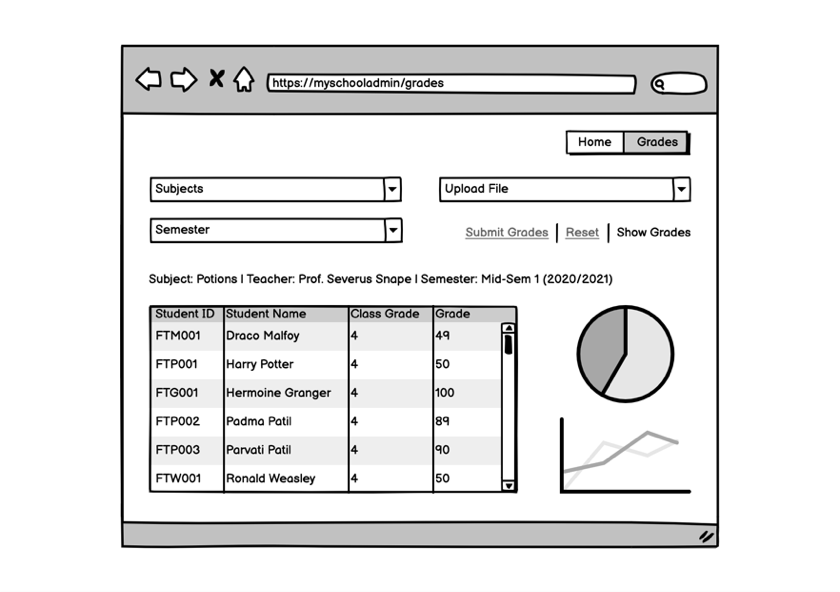
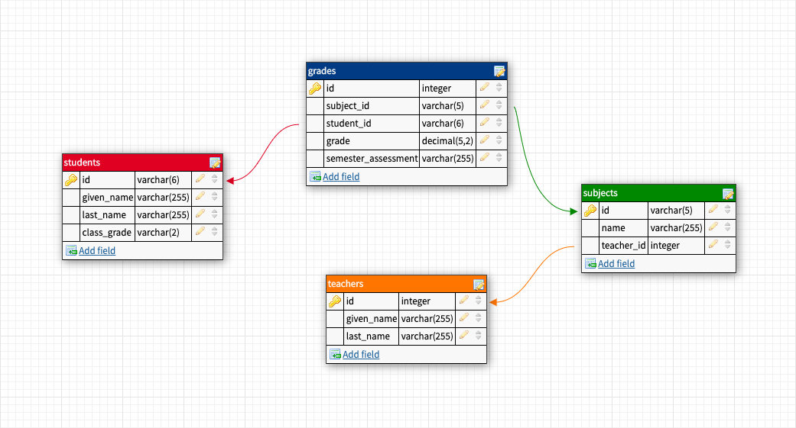
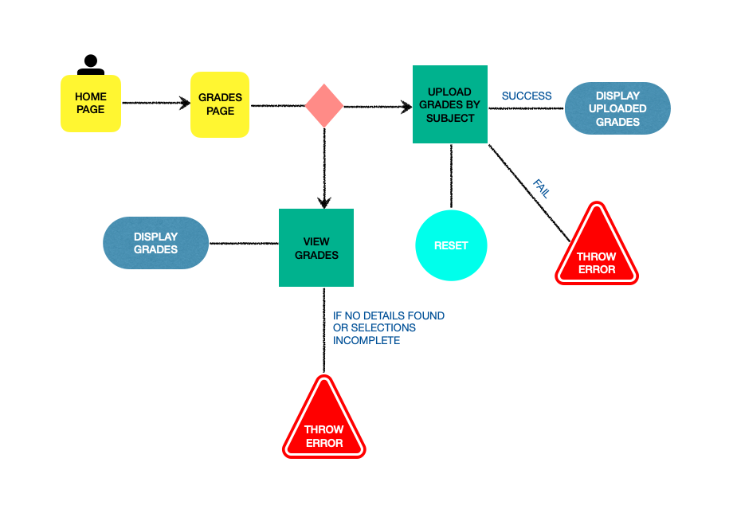

# myschooladmin



A Minimum Viable Product (MVP) for users to upload school grades, then view and get grades report onclick.

## Motivation

**FOR** school administrators and teachers, **WHO** are in need to ease administrative and grades report workload. **THE** MVP IS a Single Page Application **THAT** generates grades report promptly, **UNLIKE** time consuming email and spreadsheet report collaboration between teachers and administrators. **THIS PRODUCT** rids the user's hassle of compiling all grades from many files manually to create a report.

## Features

- Upload school grades excel file by subject
- Retrieve grades report onclick with data visualization

## Feature Wish List

### Nice To Have Features

- Authorized user login
- Download report to excel file
- Generate attendance report and invoicing
- Generate financial statement and report
- School library online platform
- Real time students assignment/ project collaboration

## Tech / Framework

Built with Vue.Js, Node.Js/ Express.Js and MySQL.

### Why Did I Choose This Tech?

Tech Stack | Reason
---------- | ------
VueJs | It is reactive, user and developer friendly. It has a simplistic approach and is flexible. It also has good documentation and an impressive support for the platform. It can be easily integrated into other frameworks and this is appealing for future project expansion.
NodeJs / ExpressJs | It uses JavaScript as the main application to create new applications. It is easy to maintain and modify, lightweight and fast. The growing NPM (Node Package Manager) gives developers multiple tools and modules to use.
MySQL | It is an open source database that facilitates effective management of databases and it provides comprehensive support for every application development need. It is stable, reliable and used by many well-known enterprises. It offers data security, on-demand scalability and high performance.

## Database Schema



## API Routes Plan

URI | HTTP Method | Description
--- | ----------- | -----------
/users/myschooladmin | POST | Create grades
/users/myschooladmin | GET | Retrieve all grades
/users/myschooladmin/students | GET | Retrieve list of students
/users/myschooladmin/grades/:student_id | GET | Retrieve grades by student id
/users/myschooladmin/averagegrade/:student_id | GET | Retrieve average grades by student id
/users/myschooladmin/averagesubjectgrades | GET | Retrieve list of average subject grades

## User Flow Diagram



## Architecture Drawing


## Setup

### Dependencies

- Run `npm install` in project directory. This will install server-related dependencies such as `express`
- `cd client` and run `npm install`. This will install client dependencies

### Database Prep

- Access the MySQL interface in your terminal by running `mysql -u root -p`
- Create a new database called myschooladmin: `create database myschooladmin;`
- Create a `.env` file in project directory and add

```bash
  DB_NAME=myschooladmin
  DB_PASS=YOURPASSWORD
```

- Replace `YOUR_PASSWORD` with your actual password

- Run `npm run migrate` in the main folder of this repository, in a new terminal window. This will create 4 tables (grades, students, subjects and teachers) in your database.

### Run Your Development Servers

- Run `npm start` in project directory to start the Express server on port 5000
- `cd client` and run `npm run serve` to run your development build. The app will run on `http://localhost:8080` as the default port.

## Resources

- [MySQL Cheat Sheet](http://www.mysqltutorial.org/mysql-cheat-sheet.aspx)
- [MySQL](https://dev.mysql.com/doc/refman/8.0/en/database-use.html)
- [Fetch](https://developer.mozilla.org/en-US/docs/Web/API/Fetch_API/Using_Fetch)
- [Promises](https://developer.mozilla.org/en-US/docs/Web/JavaScript/Reference/Global_Objects/Promise)
- [Vue Documentation](https://vuejs.org/v2/guide/)

## Notes

_This is a student project that was created at [CodeOp](http://CodeOp.tech), a full stack development bootcamp in Barcelona and [Rebound.Asia](https://www.rebound.asia/breakthrough), by TechSprint Academy (Malaysia’s first women only coding academy)._
